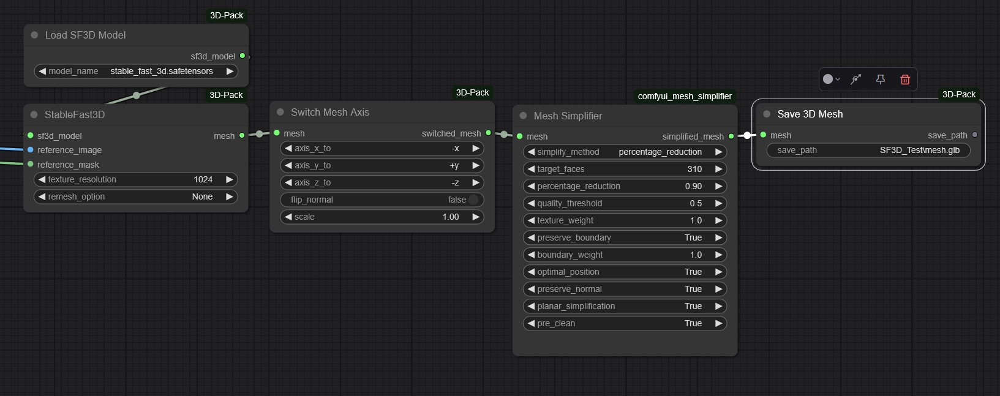

# Mesh Simplifier for ComfyUI

A custom node for ComfyUI that implements mesh simplification with texture preservation using PyMeshLab. This node allows you to reduce the complexity of 3D meshes while preserving visual quality, and is compatible with ComfyUI-3D-Pack's mesh format.



## Features

- Simplify meshes by target face count or percentage reduction (e.g., from 100,000 faces to 5,000)
- Preserve texture coordinates and materials during simplification
- Pre-clean meshes to fix common issues like duplicate faces
- Fine-tune simplification with multiple quality parameters
- Works with meshes from any ComfyUI-3D-Pack node (StableFast3D, ZeroScope3D, etc.)
- Supports both textured and non-textured meshes

## Requirements

- ComfyUI
- [ComfyUI-3D-Pack](https://github.com/MrForExample/ComfyUI-3D-Pack)
- pymeshlab
- trimesh
- numpy

## Installation

1. Make sure you have ComfyUI installed and working
2. Install ComfyUI-3D-Pack if not already installed

3. Install this node:
   ```
   git clone https://github.com/roundyyy/comfyui-mesh-simplifier custom_nodes/comfyui-mesh-simplifier
   cd custom_nodes/comfyui-mesh-simplifier
   pip install -r requirements.txt
   ```
4. Restart ComfyUI

## Usage

The Mesh Simplifier node is found in the "3D/Mesh" category.

### Typical Workflow

1. Generate or load a 3D mesh using ComfyUI-3D-Pack
2. Connect the mesh output to the Mesh Simplifier node
3. Configure simplification parameters
4. Save the simplified mesh with the Save 3D Mesh node

### Parameters

- **mesh**: Input mesh from any ComfyUI-3D-Pack node
- **simplify_method**: Choose between target face count or percentage reduction
- **target_faces**: Target number of faces to retain (default: 1000)
- **percentage_reduction**: Percentage of faces to remove (0.75 = reduce by 75%)
- **quality_threshold**: Quality threshold for edge collapse (higher = better quality)
- **texture_weight**: Weight given to texture preservation (higher = better textures)
- **preserve_boundary**: Whether to preserve mesh boundaries
- **boundary_weight**: Weight given to boundary preservation
- **optimal_position**: Use optimal position for vertices
- **preserve_normal**: Preserve normal vectors
- **planar_simplification**: Enable planar simplification
- **pre_clean**: Perform pre-cleaning operations (merge close vertices, remove duplicates)


## How It Works

The node uses a file-based approach to simplify meshes:

1. The input mesh is saved to a temporary OBJ file
2. PyMeshLab loads and processes the mesh:
   - For textured meshes, it uses `meshing_decimation_quadric_edge_collapse_with_texture`
   - For non-textured meshes, it uses `meshing_decimation_quadric_edge_collapse`
3. The simplified mesh is loaded back into ComfyUI-3D-Pack format
4. Original texture maps are preserved and transferred to the simplified mesh

## Troubleshooting

- **Error "Current mesh does not have Per Wedge Texture Coords"**: This happens when texture coordinates are lost. Try using lower simplification values or turn off "pre_clean".
- **Missing textures**: Make sure to connect the simplified mesh directly to a Save_3D_Mesh node to preserve textures.
- **Crashes with large meshes**: Try increasing "target_faces" or decreasing "percentage_reduction" to reduce memory usage.

## License

This project is licensed under GPL v3, as it uses PyMeshLab which is GPL licensed.

## Acknowledgements

This project uses PyMeshLab. When using this tool in academic projects, please cite:

```
@software{pymeshlab,
  author       = {Alessandro Muntoni and Paolo Cignoni},
  title        = {{PyMeshLab}},
  month        = jan,
  year         = 2021,
  publisher    = {Zenodo},
  doi          = {10.5281/zenodo.4438750}
}
```

Special thanks to:
- [MrForExample](https://github.com/MrForExample) for ComfyUI-3D-Pack
